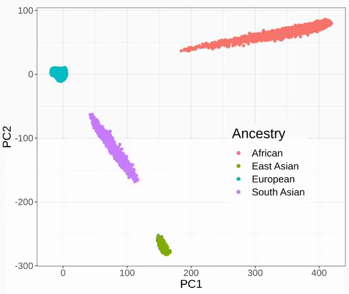
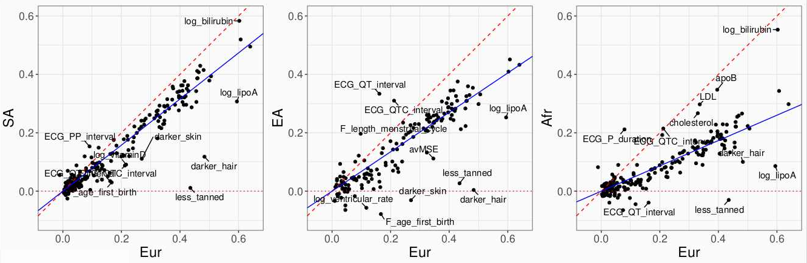
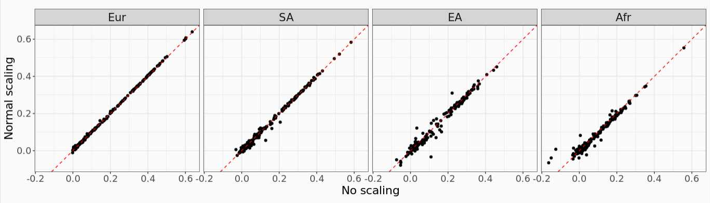
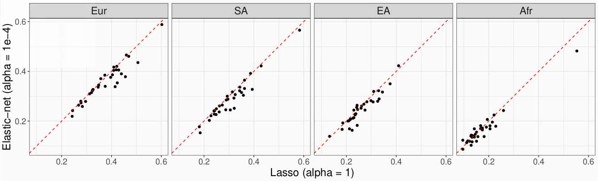
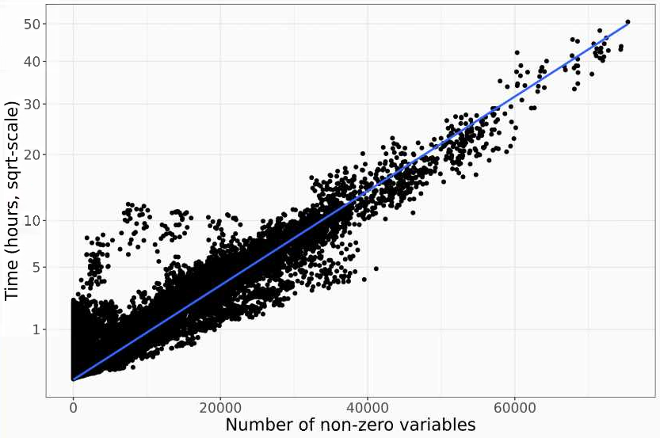
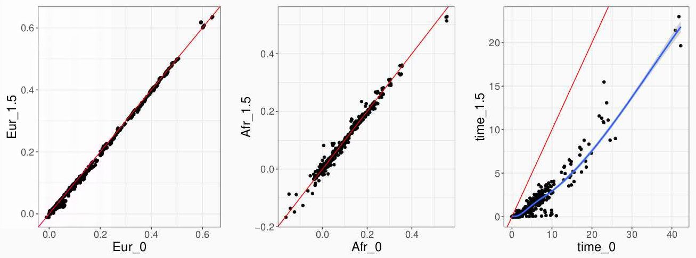

```{r setup, include=FALSE}
options(htmltools.dir.version = FALSE)
knitr::opts_chunk$set(echo = FALSE, fig.align = 'center', dev = "svg")
```

class: title-slide center middle inverse

# Phenome-wide polygenic scores<br>from the UK Biobank

<br>

### Florian Privé

---

class: center middle inverse

# Introduction

---

## Summary statistics vs individual-level data

<br>

- Summary statistics are not the only way to derive PGS

- Individual-level data can be used directly (i.e. the genotype matrix and the phenotypes)

- This makes sense now with large datasets such as the UKBB

- Plus, we can derive PGS for multiple phenotypes

- Using our fast implem of penalized regressions [1], we can  derive PGS for **240 traits** using **only the UK Biobank** genetic and phenotypic data.

.footnote[[1] Privé, Florian, et al. "Efficient implementation of penalized regression for genetic risk prediction." Genetics 212.1 (2019): 65-74.]

---

## Major strength of the UK Biobank and this study

<br>

- A major concern about PGS is their transferability to other ancestries    
(e.g. bad performances in Africans for PGS trained in Europeans)

- We are well positioned to reiterate this concern with strong evidence

    - UKBB data contains 450K Europeans, 9K South Asians, 2K East Asians and 7K Africans
    
    - who had their genetic and phenotypic information derived **in the same way**
    
    - plus we (I?) expect that LASSO penalty strongly limits the overfitting in the training data, and potentially transfer better to other ancestries

---

class: center middle inverse

# Methods

---

## Genetic data


- 1,117,182 HapMap3 variants 

- Training based on 434,868 individuals of European ancestry +    
testing in 8636 South Asians, 1803 East Asians and 6983 Africans

```{r, out.width="62%"}

```

---

## Phenotypic data

<br>

- Mapped ICD10 and ICD9 codes to phecodes $\rightarrow$ 104 phecodes with sufficient prediction

- Used other UKBB fields to define 111 continuous and 25 binary phenotypes

    $\Rightarrow$ 111 continuous + 129 binary = **240 phenotypes**
    
<br>

Some examples:

- body measures: height, BMI, BMD, etc.

- blood biochemistry: cholesterol, vitamin D, etc.

- ECG measures

- misc

---

## Penalized regressions

Find $\mu$, $\beta$, $\gamma$ that minimize

$$\underbrace{ ||y - (\mu + G \beta + X \gamma)||_2^2 }_\text{Loss function} + \underbrace{ \lambda \left( \alpha \|\beta\|_1 + (1 - \alpha) \frac{\|\beta\|_2^2}{2} \right) }_\text{Penalisation} ~,$$

where $G$ is the genotype matrix, $X$ is the covariate matrix, $y$ is the (quantitative) phenotype and $\lambda$ is a hyper-parameter that needs to be chosen.

Using $\alpha = 1$ is the LASSO, and I'm using $\alpha = 10^{-4}$ to approximate a ridge regression.

<br>

Also just added two extensions for the LASSO:

- allows different scaling (normal, Pareto, none)

- adaptive LASSO $\rightarrow$ less penalty for largest effects

---

## Prediction accuracy

<br>

**Partial correlation** between PGS (x) and phenotype (y), adjusting for covariates (z).

Basically, regress out x and y by z to get x_eps and y_eps, and compute cor(x_eps, y_eps).

---

class: center middle inverse

# Results

---

## Lasso results in different ancestries

<br>

```{r, out.width="100%"}

```

<br>

Robust slope of pcor_other ~ pcor_eur, squared:

- 62.3% for South Asians
- 45.5% for East Asians
- 18.8% for Africans

---

## Importance of scaling? (i.e. of heritability model)

<br>

```{r, out.width="100%"}

```

<br>

- Normal scaling = all variants contribute same heritability

- No scaling = common variants contribute more heritability

<br>

I expected common variants to generalize better.

---

## Lasso vs elastic-net

<br>

```{r, out.width="100%"}

```

<br>

To note:

- only 32 phenotypes because enet takes time

- some models have been early-stopped at 500K non-zero variables

---

## Supp -- How fast is the LASSO implementation?

<br>

```{r, out.width="75%"}

```

<br>

Running time is quadratic with the number of non-zero variables.

---

## Supp -- Adaptive LASSO is even faster

<br>

```{r, out.width="100%"}

```

<br>

Can fasten lasso fitting using power_adaptive = 1.5 (even sparser models)    
without losing prediction accuracy apparently

Sparser models have similar performance in African ancestry as well

---

class: center middle inverse

# That's all folks!
