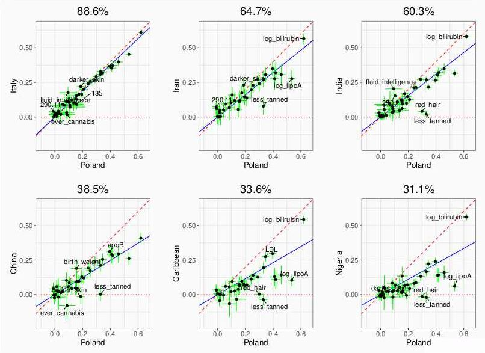
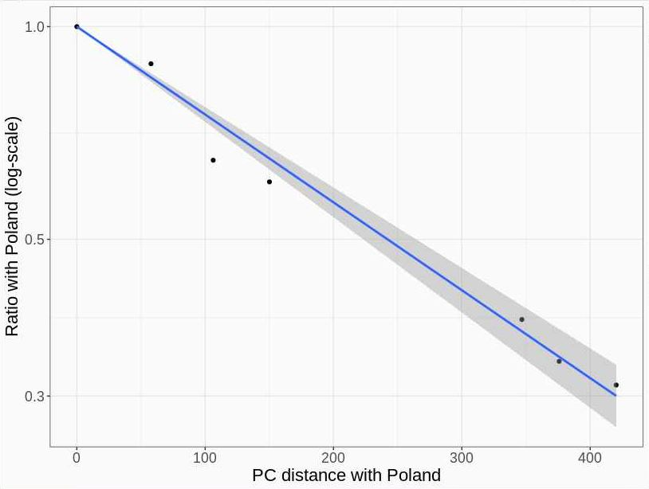
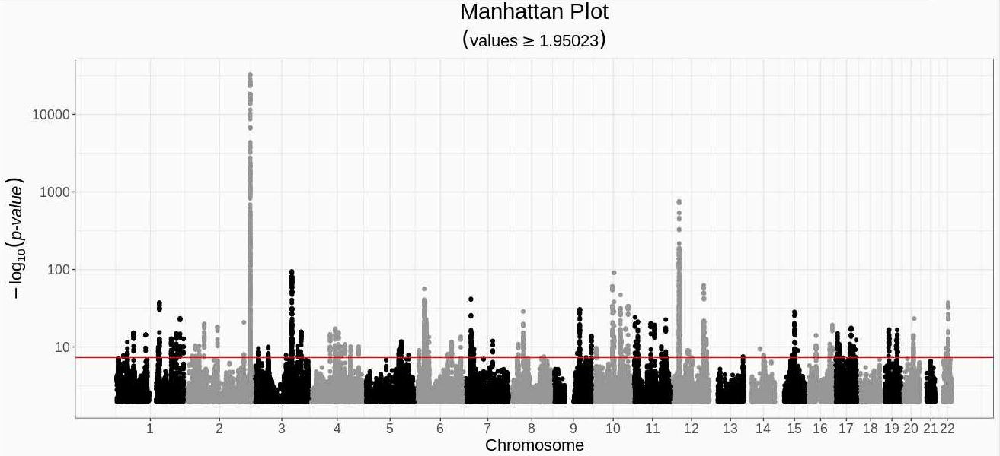
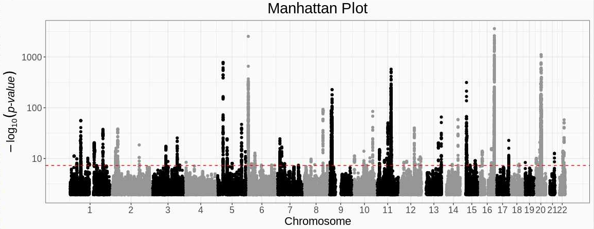
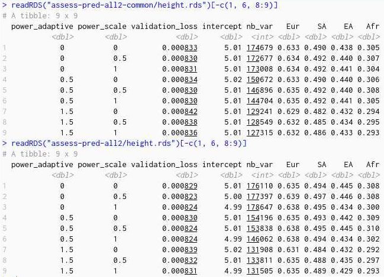
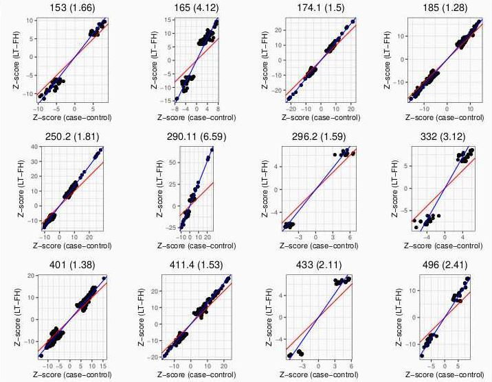
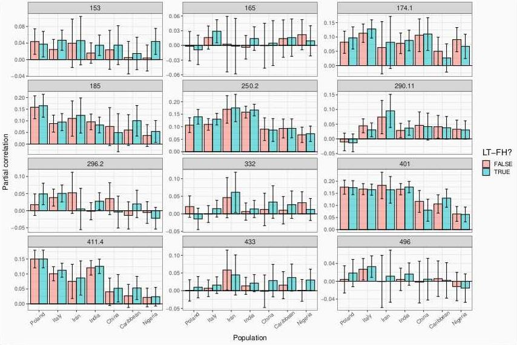

```{r setup, include=FALSE}
options(htmltools.dir.version = FALSE)
knitr::opts_chunk$set(echo = FALSE, fig.align = 'center', dev = "svg")
```

class: title-slide center middle inverse

# Phenome-wide polygenic scores<br>from the UK Biobank

## (2nd meeting)

<br>

### Florian Privé

---

class: center middle inverse

# Introduction

---

### Summary statistics vs individual-level data

<br>

- Summary statistics are not the only way to derive PGS

- Individual-level data can be used directly (i.e. the genotype matrix and the phenotypes)

- This makes sense now with large datasets such as the UKBB

- Plus, we can derive PGS for multiple phenotypes

- Using our fast implem of penalized regressions [1], we can  derive PGS for **240 traits** using **only the UK Biobank** genetic and phenotypic data.

.footnote[[1] Privé, Florian, et al. "Efficient implementation of penalized regression for genetic risk prediction." Genetics 212.1 (2019): 65-74.]

---

### Major strength of the UK Biobank and this study

<br>

- A major concern about PGS is their transferability to other ancestries    
(e.g. bad performances in Africans for PGS trained in Europeans)

- We are well positioned to reiterate this concern with strong evidence

    - UKBB data contains 450K Europeans, 9K South Asians, 2K East Asians and 7K Africans
    
    - who had their genetic and phenotypic information derived **in the same way**
    
    - plus we (I?) expect that LASSO penalty strongly limits the overfitting in the training data, and potentially transfer better to other ancestries

---

class: center middle inverse

# Methods

---

### Genetic data


- 1,040,096 HapMap3 variants 

- Training based on 444,464 individuals of British ancestry +    
testing in 4299 from Poland, 6955 from Italy, 1220 from Iran, 6667 from India, 1846 from China, 2652 from the Caribbean, and 4072 from Nigeria

```{r, out.width="62%"}
knitr::include_graphics("../figures/UKBB-matched-country.png")
```

.footnote[Privé, Florian. "Ancestry inference and grouping from principal component analysis of genetic data." bioRxiv (2020).]

---

### Phenotypic data

<br>

- Mapped ICD10 and ICD9 codes to phecodes $\rightarrow$ 104 phecodes with sufficient prediction

- Used other UKBB fields to define 111 continuous and 25 binary phenotypes

    $\Rightarrow$ 111 continuous + 129 binary = **240 phenotypes**
    
<br>

Some examples:

- body measures: height, BMI, BMD, etc.

- blood biochemistry: cholesterol, vitamin D, etc.

- ECG measures

- misc

---

### Prediction accuracy

<br>

**Partial correlation** between PGS (x) and phenotype (y), adjusting for covariates (z).

Basically, regress out x and y by z to get x_eps and y_eps, and compute cor(x_eps, y_eps).

---

class: center middle inverse

# Results

---

### Lasso results in different ancestries

```{r, out.width="80%"}

```

.footnote[Percentage in title = squared slope (in blue)]

---
### Drop in prediction versus distance

```{r, out.width="80%"}

```

Recall: $\text{dist}_{PC}^2 \propto F_{ST}$

---

### Manhattan plots for bilirubin and "less tanned"

```{r, out.width="80%"}


```

---

### Restricting to MAF > 5%

```{r, out.width="90%"}

```

---

### Using family history (LT-FH) to increase power (for GWAS)

```{r, out.width="70%"}

```

.footnote[Hujoel, M.L.A., Gazal, S., Loh, P. et al. Liability threshold modeling of case–control status and family history of disease increases association power. Nat Genet 52, 541–547 (2020).]

---

### Using LT-FH to increase power (for prediction)

```{r, out.width="100%"}

```

---

class: center middle inverse

# That's all folks!
