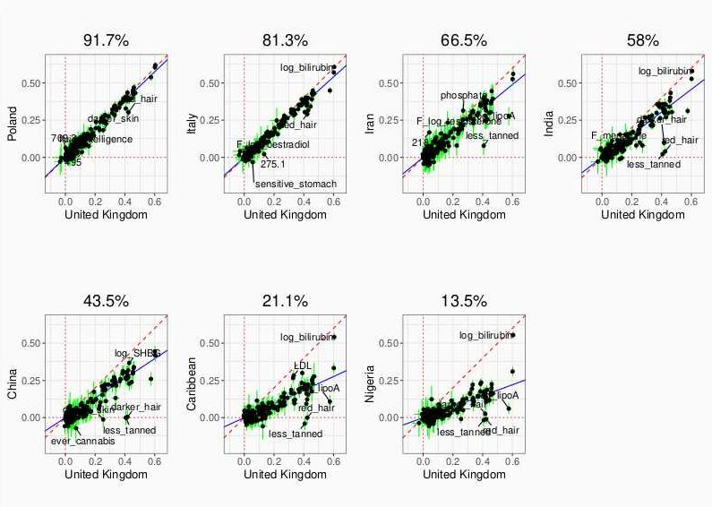
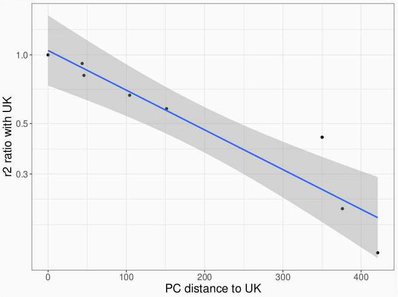
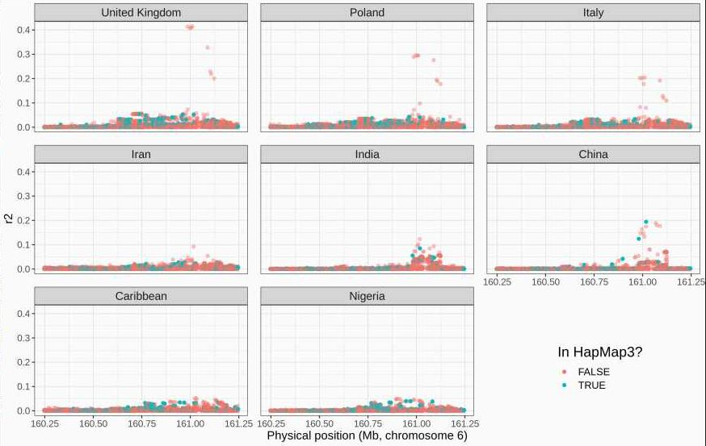
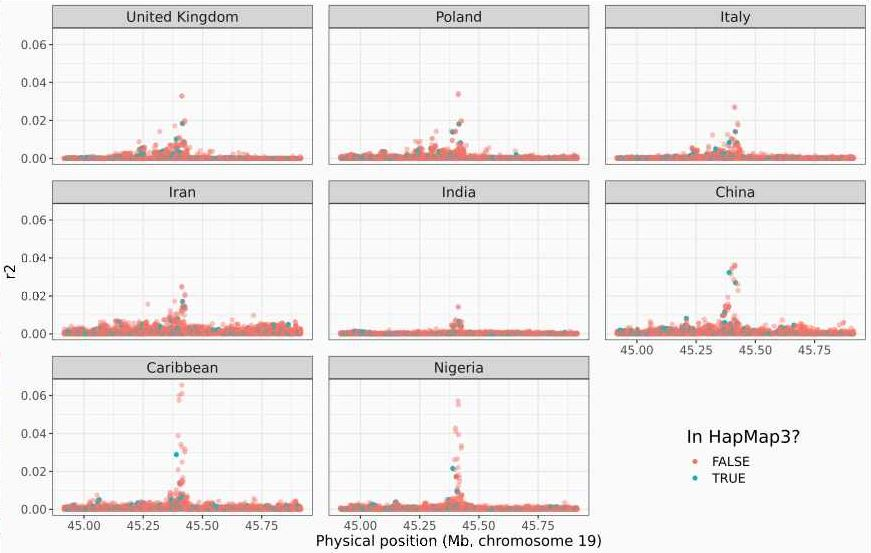
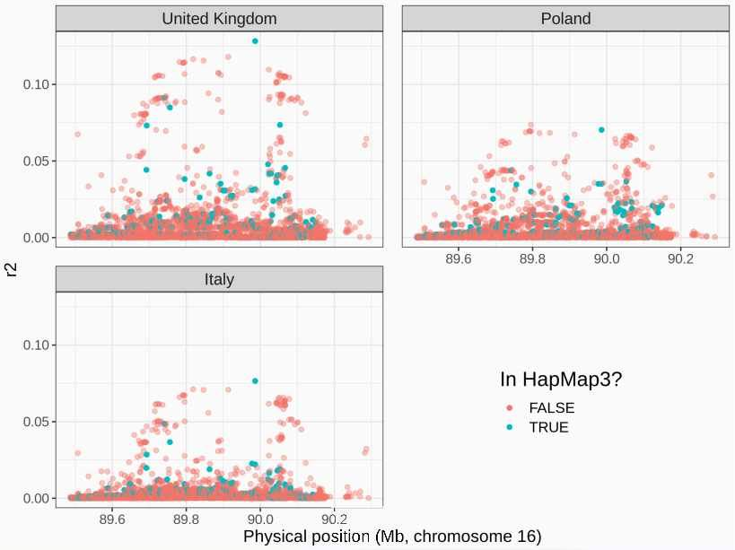
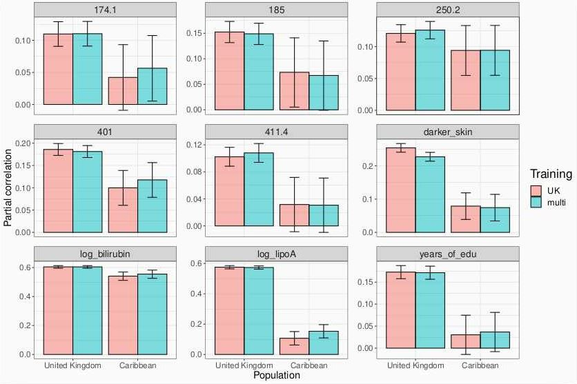

```{r setup, include=FALSE}
options(htmltools.dir.version = FALSE)
knitr::opts_chunk$set(echo = FALSE, fig.align = 'center', dev = "svg")
```

class: title-slide center middle inverse

# Phenome-wide polygenic scores<br>from the UK Biobank

## (3rd meeting)

<br>

### Florian Privé

---

## Changes since last time

<br>

- filter out first and second degree relatives before all analyses (KINSHIP > 2^-3.5)

- keep 20,000 British individuals for testing (+ still other countries)

<br>

- zoom around top hits

- try training with multiple ancestries 

    - training with (391,124 - 24,061) individuals of British ancestry + 4136 from Poland, 6660 from Italy, 1200 from Iran, 6331 from India, 1810 from China, and 3924 from Nigeria.

    - testing with same 20,000 British + 2484 from the Caribbean

---

class: center middle inverse

# Results

---

### Lasso results in different ancestries

```{r, out.width="85%"}

```

.footnote[Percentage in title = squared slope (in blue)]

---

### Drop in prediction versus distance

```{r, out.width="80%"}

```

Recall: $\text{dist}_{PC}^2 \propto F_{ST}$ -> having trouble publishing this

---

class: center middle inverse

# Results

---

### Zoomed manhattan plots for bilirubin

```{r, out.width="95%"}
knitr::include_graphics("../figures/zoom_bilirubin.JPG")
```

---

### Zoomed manhattan plots for lipoA

```{r, out.width="95%"}

```

---

### Zoomed manhattan plots for LDL

```{r, out.width="95%"}

```

---

### Zoomed manhattan plots for "red hair"

```{r, out.width="90%"}

```

---

### Model with multiple ancestries

```{r, out.width="95%"}

```

---

class: center middle inverse

# That's all folks!
